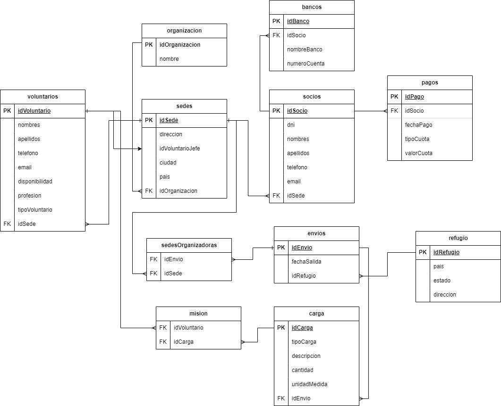

# Administracion ONG

Una organización no gubernamental se encarga de enviar ayuda material (medicamentos y alimentos) y ayuda humanitaria (personal sanitario) a campos de refugiados. Esta organización obtiene sus ingresos de las cuotas de los socios, de los que se desea conocer los datos personales, la cuenta bancaria en donde se realizan los cargos anuales, la fecha de pago y el tipo de cuota. En la actualidad hay tres tipos de cuotas, pudiendo variar en el futuro: mínima (10 US anuales), media (20 US anuales) o máxima (30 US anuales).

Cada socio pertenece a una de las sedes de la organización, cada una de ellas ubicada en una ciudad distinta. De las sedes se desea conocer el domicilio y el nombre de su director. La organización cuenta con dos tipos de voluntarios: los que realizan labores humanitarias (personal sanitario) y los que realizan labores administrativas (personal administrativo). De los primeros se desea conocer su profesión (médico, ATS, etc.), su disponibilidad actual (sí/no) y el número de trabajos en los que ha participado. De todos los voluntarios se desea conocer los datos personales y la sede en la que se inscribieron.

Cada envío tiene un destino y una fecha de salida. Para identificar los envíos, se les asigna un código único. Además, cada envío es organizado por una o varias sedes. Los envíos de ayuda material pueden ser de alimentos, debiéndose conocer el número de toneladas de cada alimento que se manda; o pueden ser de medicamentos, debiéndose conocer el número de unidades de cada medicamento. De los envíos de ayuda humanitaria se debe conocer el número de voluntarios que se mandan de cada profesión (por ejemplo: 10 médicos, 20 ATS) y quienes son cada uno de ellos.

## Requisitos Funcionales

### SEDE
- Registrar Sede - LISTA
- Consultar x id sedes - LISTA
- Actualizar x id sede - LISTA
- Eliminar x id sede - LISTA
- Listar todas las sedes - LISTA

### SOCIO
- Registrar Socio - LISTA
- Consultar x id - LISTA
- Actualizar x id - LISTA
- Eliminar un socio - LISTA
- Listar por tipo de cuota - LISTA

### VOLUNTARIO
- Registrar Voluntario - LISTA
- Consultar x id - LISTA
- Actualizar x id - LISTA
- Eliminar un voluntario - LISTA
- Listar por profesion - LISTA
- Listar por sede - LISTA

### ENVIOS AYUDA
- Registrar un envio - LISTA
- Consultar x id, con los datos completos de las sedes y refugios. - LISTA

## DIAGRAMA RELACIONAL

